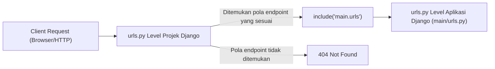

# Tutorial 1: Pengenalan Aplikasi Django dan *Model-View-Template* (MVT) pada Django


Pemrograman Berbasis Platform (CSGE602022) — diselenggarakan oleh Fakultas Ilmu Komputer Universitas Indonesia, Semester Ganjil 2025/2026

_Terakhir diperbarui: 21 Agustus 2025, pukul 21.00 WIB_


---
### Tujuan Pembelajaran
Setelah menyelesaikan tutorial ini, mahasiswa diharapkan untuk dapat:

- Mengerti konsep **MVT** pada aplikasi Django
- Mengerti bagaimana **alur Django menampilkan sebuah halaman HTML**
- Mengerti konfigurasi *routing* yang ada pada `urls.py`
- Memahami kaitan *models*, *views* dan *template* pada Django
- Memahami pembuatan *unit test* pada *framework* Django

## Pengenalan Konsep MVT (Model-View-Template)

Dalam dunia *web development*, terdapat berbagai pola arsitektur yang dapat membantu programmer dalam merancang dan mengembangkan sebuah aplikasi. Contohnya ada MVC (Model-View-Controller), MVT (Model-View-Template), dan masih banyak lagi. Pada kuliah PBP, kita akan lebih terfokus dalam MVT yang digunakan oleh Django.

### Apa Itu Konsep MVT?

Seperti yang sudah kalian lihat, MVT terdiri atas Model, View, dan Template. Secara sederhana:
- Model merupakan data & logika bisnis
- Template merupakan tampilan akhir yang dilihat oleh pengguna
- View merupakan jembatan yang menghubungkan antara data(model) dan tampilan(template)

### Apa Itu Model?

Model bertugas untuk **mengatur** dan **mengelola** data pada sebuah aplikasi.
Pada Django sendiri, sudah disediakan *Object Relational Mapping(ORM)* sehingga kamu bisa bekerja dengan command python, tanpa SQL langsung seperti pada database umumnya.

Contoh model:
```python
class News(models.Model):
    title = models.CharField(max_length=255)
    content = models.TextField()
    date_added = models.DateField(auto_now_add=True)
```

### Apa Itu View?

View menangani logika yang akan ditampilkan kepada pengguna. Alur view meliputi penerimaan request dari pengguna, mengambil data dari model, lalu mengirimkannya ke template untuk ditambilkan ke pengguna.

Contoh view:
```python
def show_main(request):
    news_list = News.objects.all()
    return render(request, "main.html", {"news_list": news_list})
```

### Apa Itu Template?

Template merupakan berkass HTML yanng menentukan bagaimana aplikasi ditampilkan.

Contoh template:
```html
<h1>Daftar Berita</h1>
<ul>
  
    <li>{{ news.title }} - {{ news.date_added }}</li>
  
</ul>
```

### Alur MVT

1. Pengguna mengakses URL tertentu melalui browser.
2. Django akan memetakan URL tersebut ke View melalui `urls.py`.
3. View mengambil dan memproses data dari Model apabila dibutuhkan.
4. Output dari View ditampilkan ke pengguna dengan cara dikirim ke Template

:::info
Alurnya secara simple:
Request → urls → View → Model → View → Template → Response
:::

### Manfaat MVT

Manfaat MVT ada banyak, di antaranya:
1. Pemisahan Tugas:
Logika aplikasi, tampilan, dan data dipisahkan secara jelas dan rapih sehingga lebih mudah dikelola untuk developer.
2. Kode yang Lebih Terstruktur:
Aplikasi menjadi lebih modular, mudah diuji dengan test, dan juga scalable.
3. Reuseability:
Template & View dapat digunakan kembali di berbagai bagian aplikasi secara berulang.

## Pre-Tutorial Notes

Sebelum memulai tutorial ini, pastikan Anda telah menyelesaikan Tutorial 0 dengan hasil sebagai berikut:

1. Struktur direktori football-news di local:
    
    

2. Struktur direktori repository football-news di GitHub:
    
    

Jika tidak sengaja push file sensitif seperti `.env`, `.env.prod`, `db.sqlite3`, atau folder `env/`, hapus dari Git menggunakan:

```bash
git rm --cached .env .env.prod db.sqlite3
git rm -r --cached env/
```

**Catatan**: Perintah di atas menghapus file sensitif dari tracking Git ke depannya.

Cek apakah `.gitignore` sudah berisi file sensitif tersebut:
```bash
cat .gitignore
```

Jika belum ada, tambahkan ke `.gitignore`:
```
.env*
db.sqlite3
env/
```
Kemudian buat commit clean up:

```bash
git add .
git commit -m "cleanup"
```

Terakhir, push semua perubahan ke GitHub dan PWS:
```bash
git push origin master
git push pws master
```

Dengan demikian, kita dapat meminimalisasi risiko keamanan dari credential yang ter-expose di repository publik. 

## Tutorial: Membuat Aplikasi Django beserta Konfigurasi Model

Dalam tutorial ini, akan dijelaskan mengenai konsep aplikasi dan proyek dalam Django.

**Apa Itu Proyek dan Aplikasi dalam Django?**

- **Proyek (*Project*)** adalah keseluruhan proyek web yang kamu bangun dengan menggunakan Django. **Proyek berisi berbagai aplikasi** yang berfungsi secara bersama untuk menciptakan situs web atau aplikasi web yang lengkap.

- **Aplikasi (*Apps*)** adalah unit modular yang melakukan tugas-tugas spesifik dalam suatu proyek Django. Setiap aplikasi dapat memiliki model, tampilan, *template*, dan URL yang terkait dengannya. Aplikasi memungkinkanmu untuk membagi fungsionalitas proyek menjadi bagian-bagian terpisah yang dapat dikelola secara independen.

Sebelum dimulai, kamu perlu mengingat kembali bahwa direktori utama adalah direktori **terluar** (`football-news`), sedangkan direktori proyek adalah direktori **di dalam** direktori utama (`football_news`).

### Langkah 1: Persiapan Awal

1. Buka Direktori Utama **`football-news`**.

    - Sebelum memulai, pastikan kamu berada di direktori **utama** **`football-news`** yang telah dibuat pada Tutorial 0.
    - Pengembangan proyek Django kamu pada tutorial sebelumnya akan dilanjutkan pada direktori ini 😎.

2. Buka terminal atau *command prompt* dan pastikan kamu sudah berada pada direktori utama, **`football-news`**.

:::info

- Gunakan perintah `cd [direktori]` untuk berpindah direktori ke direktori lain yang ingin dituju. Perintah ini sangat penting untuk diingat, karena keahlian menggunakan terminal akan bermanfaat tidak hanya untuk mata kuliah PBP, tetapi juga mata kuliah lain nantinya.

:::

3. Aktifkan *virtual environment* yang telah dibuat sebelumnya dengan menjalankan perintah berikut. **(Mohon perhatikan sistem operasi yang kamu gunakan)**.

   - **Windows:**

     ```bash
     env\Scripts\activate
     ```

   - **Unix (Linux & Mac OS):**

     ```bash
     source env/bin/activate
     ```
:::info
- Untuk pengguna Windows, apabila kamu mendapatkan error berbunyi "*the execution of scripts is disabled on this system...*", berikut adalah solusi yang dapat kamu coba:
    - Buka _PowerShell_ sebagai *administrator* dan jalankan perintah berikut:
        ```bash
        Set-ExecutionPolicy Unrestricted -Force
        ```
    - Pilih opsi `A` dan tekan `Enter`.
- Untuk pengguna sistem operasi berbasis Unix (Linux & macOS), jika kamu mendapatkan error berbunyi "*... Permission Denied*", berikut adalah solusi yang dapat kamu coba:
    - Jalankan perintah berikut:
        ```bash
        chmod +x env/bin/activate
        ```
:::

### Langkah 2: Membuat Aplikasi `main` dalam Proyek *football-news*

Kamu akan membuat aplikasi baru bernama `main` dalam proyek *football-news*.

1. Jalankan perintah berikut untuk membuat aplikasi baru dengan nama **main**.

     ```shell
     python manage.py startapp main
     ```

    Setelah perintah di atas dijalankan, direktori baru dengan nama `main` akan terbentuk. Direktori main akan berisi struktur awal untuk aplikasi Django kamu.

:::warning
Jika kamu masih bingung mengenai istilah-istilah baru seperti **direktori utama**, **direktori proyek**, **direktori aplikasi**, *it's' okay!* Kamu akan terbiasa sesiring berjalannya waktu. Semangat!
:::

2. Mendaftarkan aplikasi `main` ke dalam proyek.

   - Buka berkas `settings.py` di dalam direktori proyek `football_news`.
   - Tambahkan `'main'` ke dalam daftar aplikasi yang ada sebagai elemen paling terakhir. Daftar aplikasi dapat kamu akses pada variabel `INSTALLED_APPS`.

     ```python
     INSTALLED_APPS = [
         ...,
         'main'
     ]
     ```

Dengan melakukan langkah-langkah tersebut, kamu telah mendaftarkan aplikasi `main` ke dalam proyek *football news* kamu.

## Tutorial: Implementasi *Template* Dasar

Pada tahap ini, kamu akan membuat *template* yang berada pada direktori `templates` yang berada di `main`. *Template* ini digunakan untuk menampilkan data program *football news* kamu.

:::warning
Saat ini, aplikasi *football news* belum menampilkan data apapun. Data akan ditampilkan pada tutorial 2. Semangat!
:::

### Langkah 1: Membuat dan Mengisi Berkas `main.html`

Mari berkenalan dengan HTML terlebih dahulu. HTML (*Hypertext Markup Language*) adalah bahasa penanda yang digunakan pada halaman web untuk menafsirkan dan menulis teks, gambar dan bahan lainnya secara visual maupun suara.

:::warning
Hint: Kamu akan mempelajari HTML lebih lanjut di tutorial 4.
:::

1. **Buat direktori baru** bernama `templates` di dalam direktori aplikasi `main`.

2. Di dalam direktori `templates`, **buat berkas baru** bernama `main.html`. Isi berkas `main.html` dengan kode berikut. **Ubah nama dan kelas sesuai dengan data diri kamu!**

     ```html
     <h1>Football News</h1>

     <h4>NPM: </h4>
     <p>2406123456</p> <!-- Ubah sesuai dengan npm kamu -->
     <h4>Name: </h4>
     <p>Pak Bepe</p> <!-- Ubah sesuai dengan nama kamu -->
     <h4>Class: </h4>
     <p>PBP A</p> <!-- Ubah sesuai dengan kelas kamu -->
     ```

3. Buka berkas HTML di peramban web.

   - Sebelum dihubungkan dengan aplikasi, cobalah membuka berkas `main.html` di peramban web-mu.
   - Perlu dicatat bahwa pada tahap ini **hanya untuk memeriksa** tampilan dasar HTML dan **belum terhubung dengan Django.**
   - Berikut merupakan contoh tampilan HTML yang diharapkan.
     

## Tutorial: Implementasi Model Dasar

### Langkah 1: Mengubah Berkas `models.py` dalam Aplikasi `main`
Pada langkah ini, kamu akan mengubah berkas `models.py` yang terdapat di dalam direktori aplikasi `main` untuk mendefinisikan model baru.

1. Buka berkas `models.py` pada direktori aplikasi `main`.
2. Isi berkas `models.py` dengan kode berikut.

```python
import uuid
from django.db import models

class News(models.Model):
    CATEGORY_CHOICES = [
        ('transfer', 'Transfer'),
        ('update', 'Update'),
        ('exclusive', 'Exclusive'),
        ('match', 'Match'),
        ('rumor', 'Rumor'),
        ('analysis', 'Analysis'),
    ]
    
    id = models.UUIDField(primary_key=True, default=uuid.uuid4, editable=False)
    title = models.CharField(max_length=255)
    content = models.TextField()
    category = models.CharField(max_length=20, choices=CATEGORY_CHOICES, default='update')
    thumbnail = models.URLField(blank=True, null=True)
    news_views = models.PositiveIntegerField(default=0)
    created_at = models.DateTimeField(auto_now_add=True)
    is_featured = models.BooleanField(default=False)
    
    def __str__(self):
        return self.title
    
    @property
    def is_news_hot(self):
        return self.news_views > 20
        
    def increment_views(self):
        self.news_views += 1
        self.save()
```

**Penjelasan Kode:**

- `models.Model` adalah kelas dasar yang digunakan untuk mendefinisikan model dalam Django.
- `News` adalah nama model yang kamu definisikan.
- `CATEGORY_CHOICES` adalah tuple yang mendefinisikan pilihan kategori berita yang tersedia.
- `id` adalah field bertipe `UUIDField` yang digunakan sebagai primary key dan nilainya di-generate otomatis menggunakan `uuid.uuid4`.
- `title` adalah field bertipe `CharField` untuk judul berita, dengan panjang maksimal 255 karakter.
- `content` adalah field bertipe `TextField` untuk isi berita yang dapat menampung teks panjang.
- `category` adalah field bertipe `CharField` dengan pilihan terbatas sesuai `CATEGORY_CHOICES`, dengan nilai default 'update'.
- `thumbnail` adalah field bertipe `URLField` untuk menyimpan URL gambar thumbnail berita (opsional).
- `news_views` adalah field bertipe `PositiveIntegerField` yang menyimpan jumlah view berita, dengan nilai default 0.
- `created_at` adalah field bertipe `DateTimeField` yang otomatis berisi tanggal dan waktu saat data dibuat.
- `is_featured` adalah field bertipe `BooleanField` untuk menandai apakah berita ini ditampilkan sebagai berita unggulan.
- Method `__str__` digunakan untuk mengembalikan representasi string dari objek (dalam hal ini judul berita).
- *Decorator* `@property` digunakan untuk membuat atribut read-only yang nilainya merupakan hasil perhitungan dari atribut lain. Dalam kasus ini, `is_news_hot` akan bernilai `True` jika jumlah view berita lebih dari 20.
- Method `increment_views()` digunakan untuk menambah jumlah view berita sebesar 1 dan menyimpan perubahan ke database.

:::info
Kamu akan mempelajari lebih banyak tentang "atribut hasil derivasi" pada mata kuliah Basis Data nanti. Untuk sementara, apabila kamu ingin mengetahui lebih banyak tentang kegunaan *decorator* `@property`, kamu dapat membaca [dokumentasi Python mengenai *class property*](https://docs.python.org/3/library/functions.html#property).
:::


### Langkah 2: Membuat dan Mengaplikasikan Migrasi Model

**Apa itu migrasi model?**

- Migrasi model adalah cara Django melacak perubahan pada model basis data kamu.
- Migrasi ini adalah instruksi untuk mengubah struktur tabel basis data sesuai dengan perubahan model yang didefinisikan dalam kode terbaru kamu.

**Bagaimana cara melakukan migrasi model?**

1. Jalankan perintah berikut untuk membuat migrasi model.

    ```shell
    python manage.py makemigrations
    ```

    :::info
    `makemigrations` menciptakan berkas migrasi yang berisi perubahan model yang **belum** diaplikasikan ke dalam basis data.
    :::

2. Jalankan perintah berikut untuk menerapkan migrasi ke dalam basis data lokal.

    ```shell
    python manage.py migrate
    ```

   :::info
   `migrate` mengaplikasikan perubahan model yang tercantum dalam berkas migrasi ke basis data dengan menjalankan perintah sebelumnya.
   :::

:::warning
**Setiap kali kamu melakukan perubahan pada *model***, seperti menambahkan atau mengubah atribut, **kamu WAJIB melakukan migrasi** untuk merefleksikan perubahan tersebut.
:::

## Tutorial: Menghubungkan *View* dengan  *Template*

Pada tahap ini, kamu akan menghubungkan komponen *view* dengan komponen *template* menggunakan Django.

### Langkah 1: Mengintegrasikan Komponen MVT

Kamu akan mengimpor modul yang diperlukan dan membuat fungsi *view* `show_main`.

1. Buka berkas `views.py` yang terletak di dalam berkas aplikasi `main`.

2. Apabila belum ada, tambahkan baris-baris *import* berikut di bagian paling atas berkas.

    ```python
    from django.shortcuts import render
    ```

    **Penjelasan Kode:**

    - `from django.shortcuts import render` berguna untuk mengimpor fungsi *render* dari modul `django.shortcuts`.
    - Fungsi *render* akan digunakan untuk *render* tampilan HTML dengan menggunakan data yang diberikan.

3. Tambahkan fungsi `show_main` di bawah impor:

    ```python
    def show_main(request):
        context = {
            'npm' : '240123456',
            'name': 'Haru Urara',
            'class': 'PBP A'
        }

        return render(request, "main.html", context)
    ```

    **Penjelasan Kode:**

    - Potongan kode di atas mendeklarasikan fungsi `show_main`, yang menerima parameter `request`. Fungsi ini akan mengatur permintaan HTTP dan mengembalikan tampilan yang sesuai.
    - `context` adalah *dictionary* yang berisi data untuk dikirimkan ke tampilan. Pada saat ini, terdapat tiga data yang disertakan, yaitu:

       - `npm`: Data npm-mu.
       - `name`: Data namamu.
       - `class`: Data kelasmu.

    - `return render(request, "main.html", context)` berguna untuk me-*render* tampilan `main.html` dengan menggunakan fungsi `render`. Fungsi `render` mengambil tiga argumen:

       - `request`: Ini adalah objek permintaan HTTP yang dikirim oleh pengguna.
       - `main.html`: Ini adalah nama berkas *template* yang akan digunakan untuk me-*render* tampilan.
       - `context`: Ini adalah *dictionary* yang berisi data yang akan diteruskan ke tampilan untuk digunakan dalam penampilan dinamis.

### Langkah 2: Modifikasi *Template*

Pada tahap ini, kamu akan mengubah *template* `main.html` agar dapat menampilkan data yang telah diambil dari *model*.

1. Buka berkas `main.html` yang telah dibuat sebelumnya dalam direktori `templates` pada direktori `main`.

2. Ubah nama dan kelas menjadi struktur kode Django yang sesuai untuk menampilkan data.

    ```html
    ...
    <h5>NPM: </h5>
    <p>{{ npm }}</p>
    <h5>Name: </h5>
    <p>{{ name }}<p>
    <h5>Class: </h5>
    <p>{{ class }}</p>
    ...
    ```

    **Penjelasan Kode:**

    Sintaks Django `{{ npm }}`, `{{ name }}` dan `{{ class }}`, disebut _template variables_, digunakan untuk menampilkan nilai dari variabel yang telah didefinisikan dalam `context`.

## Tutorial: Mengonfigurasikan *Routing* URL

Setelah membuat `template` dan mengonfigurasikannya pada `view`, kita akan belajar mengenai *Routing* agar aplikasi `main` dapat diakses oleh browser client.

**Apa itu *Routing* di Django?**

*Routing* adalah proses memetakan suatu URL (endpoint) ke sebuah view function atau class-based view yang sudah kita definisikan. Saat client mengakses URL tertentu, Django akan mencocokkan URL tersebut dengan pola yang ada di file `urls.py`. Jika ada kecocokan, maka Django akan menjalankan view yang terkait dan mengembalikan response kepada client.

::: info
Tambahan: [class-based view](https://docs.djangoproject.com/en/5.2/topics/class-based-views/intro/) adalah cara lain untuk membuat view namun menggunakan class guna mengorganisasi kode lebih baik. 
:::

Mari kita mencoba mengimplementasi *routing* yang sederhana dengan memetakan http://localhost:8000/ ke fungsi `show_main` yang anda buat sebelumnya!

### Langkah 1: Mengonfigurasi *Routing* URL Aplikasi `main`

1. Buatlah berkas `urls.py` **di dalam** direktori `main`.
2. Isi `urls.py` dengan kode berikut:

```python
from django.urls import path
from main.views import show_main

app_name = 'main'

urlpatterns = [
    path('', show_main, name='show_main'),
]
```

**Penjelasan Kode**

- File `urls.py` berisi konfigurasi *routing* untuk aplikasi `main`.  
- Impor fungsi `path` dari modul `django.urls` untuk mendefinisikan pola URL.  
- Impor fungsi `show_main` dari `main.views` yang akan dipanggil saat URL cocok dengan pola yang ditentukan.  
- `app_name = 'main'` digunakan untuk memberikan namespace unik pada URL dalam aplikasi, sehingga mudah dibedakan saat ada banyak aplikasi dan endpoint dalam proyek Django.  
- `urlpatterns` adalah list berisi objek `URLPattern` yang dihasilkan oleh fungsi `path()`.  
- Pada contoh ini, hanya ada satu route `''` (root), yang akan memanggil view `show_main`.  
- Argumen opsional `name='show_main'` memudahkan kita melakukan *reverse URL* menggunakan nama, bukan hardcoded string path. 
- Lebih lanjut mengenai [reverse_url](https://docs.djangoproject.com/en/5.2/ref/urlresolvers/).

### Langkah 2: Mengonfigurasi Routing URL Proyek

Kemudian kita akan melengkapi rute URL ke aplikasi `main` dengan menambahkan `urls.py` pada level proyek agar proyek dapat melakukan pemetaan ke rute URL pada aplikasi `main`.

1. Buka berkas `urls.py` **di dalam direktori proyek `football-news`**, bukan yang ada di dalam direktori aplikasi `main`.
2. Impor fungsi `include` dari `django.urls`.
```python
...
from django.urls import path, include
...
```
3. Tambahkan rute URL berikut untuk mengarahkan ke tampilan `main` di dalam list `urlpatterns`.
```python
urlpatterns = [
    ...
    path('', include('main.urls')),
    ...
]
```
**Penjelasan Kode**
- Berkas `urls.py` proyek bertanggung jawab untuk mengatur rute URL level proyek.
- Fungsi `include` digunakan untuk mengimpor pola rute URL dari aplikasi lain (dalam hal ini dari aplikasi `main`) ke dalam berkas `urls.py` level proyek.
- Path URL '' akan diarahkan ke rute yang didefinisikan dalam berkas urls.py aplikasi main. Path URL dibiarkan berupa string kosong agar halaman aplikasi main dapat diakses secara langsung.

::: info
Sebagai bayangan, apabila kamu menggunakan `path('aplikasi_main/', ...)` pada contoh di atas, maka kamu perlu mengakses halaman http://localhost:8000/aplikasi_main/ untuk mengakses halaman aplikasi main. Karena path yang ditentukan adalah '', maka kamu dapat mengakses aplikasi main melalui URL http://localhost:8000/ saja.
:::

4. Jalankan proyek Django kamu dengan `python manage.py runserver`.
5. Bukalah http://localhost:8000/ di web browser untuk melihat halaman yang sudah kamu buat.

### Bagaimana *Routing* Bekerja?

Untuk mendapat gambaran lebih jelasnya, kamu dapat melihat gambaran berikut untuk mempelajari perbedaan `urls.py` level proyek dan aplikasi.



**Penjelasan Diagram**
- **Client Request** → Request dikirim oleh browser/HTTP client.  
- **`urls.py` Level Projek** → Semua request masuk pertama kali ke `urls.py` di project.  
   - Jika pola cocok dengan `include('main.urls')`, request diteruskan ke `urls.py` aplikasi.  
   - Jika tidak cocok, Django mengembalikan `404 Not Found`.  
- **`urls.py` Level Aplikasi** → Pola URL di dalam aplikasi (`main/urls.py`) diproses.  
- **View** → Jika cocok, fungsi/class view dijalankan.  

### Perbedaan `urls.py` pada aplikasi dan `urls.py` pada proyek?

- Berkas `urls.py` pada aplikasi mengatur rute URL spesifik untuk fitur-fitur dalam aplikasi tersebut. 
- Sementara URL tingkat proyek dapat mengimpor rute URL dari berkas `urls.py` aplikasi-aplikasi.
 
Dengan langkah-langkah di atas, kamu telah berhasil mengimplementasikan tampilan dasar dalam aplikasi main dan menghubungkannya dengan rute URL proyek. Pastikan kamu memahami setiap langkah dan informasi yang diberikan untuk mengaktifkan tampilan dalam proyek Django-mu.

## Tutorial: Pengenalan Django Unit Testing

*Unit testing* dapat digunakan untuk mengecek apakah kode yang dibuat bekerja sesuai dengan keinginan. Hal ini juga berguna ketika kamu melakukan perubahan kode. Dengan menggunakan tes, kamu bisa mengecek apakah perubahan yang dilakukan dapat menyebabkan perilaku yang tidak diinginkan pada aplikasi.

### Langkah 1: Membuat Unit Test 

1. Buatlah berkas `tests.py` pada direktori aplikasi `main`.
2. Tuliskan kode berikut pada berkas tersebut:

```python
from django.test import TestCase, Client
from .models import News

class mainTest(TestCase):
    def test_main_url_is_exist(self):
        response = Client().get('')
        self.assertEqual(response.status_code, 200)

    def test_main_using_main_template(self):
        response = Client().get('')
        self.assertTemplateUsed(response, 'main.html')

    def test_nonexistent_page(self):
        response = Client().get('/burhan_always_exists/')
        self.assertEqual(response.status_code, 404)

    def test_news_creation(self):
        news = News.objects.create(
          title="BURHAN FC MENANG",
          content="BURHAN FC 1-0 PANDA BC",
          category="match",
          news_views=1001,
          is_featured=True
        )
        self.assertTrue(news.is_news_hot)
        self.assertEqual(news.category, "match")
        self.assertTrue(news.is_featured)
        
    def test_news_default_values(self):
        news = News.objects.create(
          title="Test News",
          content="Test content"
        )
        self.assertEqual(news.category, "update")
        self.assertEqual(news.news_views, 0)
        self.assertFalse(news.is_featured)
        self.assertFalse(news.is_news_hot)
        
    def test_increment_views(self):
        news = News.objects.create(
          title="Test News",
          content="Test content"
        )
        initial_views = news.news_views
        news.increment_views()
        self.assertEqual(news.news_views, initial_views + 1)
        
    def test_is_news_hot_threshold(self):
        # Test news with exactly 20 views (should not be hot)
        news_20 = News.objects.create(
          title="News with 20 views",
          content="Test content",
          news_views=20
        )
        self.assertFalse(news_20.is_news_hot)
        
        # Test news with 21 views (should be hot)
        news_21 = News.objects.create(
          title="News with 21 views", 
          content="Test content",
          news_views=21
        )
        self.assertTrue(news_21.is_news_hot)
```

**Penjelasan Kode**
- `class Client` yang di-import dari `django.test` digunakan untuk mensimulasikan *client* dalam keperluan *unit testing*. 
- Fungsi test_main_url_is_exist bertujuan untuk mengecek apakah server memberikan respons 200 (OK) ketika client mengakses endpoint (halaman utama).
- Fungsi `test_main_using_main_template` bertujuan untuk mengecek apakah halaman utama tersebut mengembalikan kode status 200 atau dirender menggunakan template `main.html`.
- Fungsi `test_nonexistent_page` digunakan untuk menguji bahwa jika client mengakses URL yang tidak ada (misalnya /burhan_always_exists/), maka aplikasi Django akan mengembalikan kode status 404 (Not Found). 
- Fungsi `test_news_creation` bertujuan untuk menguji pembuatan objek News baru dengan atribut tertentu (title, content, category, news_views, dan is_featured). Setelah objek dibuat, dilakukan pengecekan terhadap properti is_news_hot, category, dan is_featured.
- Fungsi `test_news_default_values` bertujuan untuk menguji nilai default dari model News ketika hanya field wajib (title dan content) yang diisi, memastikan category default adalah "update", news_views adalah 0, is_featured adalah False, dan is_news_hot adalah False.
- Fungsi `test_increment_views` bertujuan untuk menguji fungsionalitas method increment_views() yang menambah jumlah views sebesar 1.
- Fungsi `test_is_news_hot_threshold` bertujuan untuk menguji threshold properti is_news_hot, memastikan news dengan 20 views tidak dianggap hot, sedangkan news dengan 21 views dianggap hot.

### Langkah 2: Menjalankan Test

Terdapat 2 cara dalam mengeksekusi *test* yaitu,

1. Menjalankan test pada seluruh `test.py` aplikasi yang ada. 
`python manage.py test` (Pastikan kamu berada pada direktori proyek karena `manage.py` berada pada level proyek).

2. Menjalankan test pada aplikasi tertentu.
`python manage.py test <nama_aplikasi>` 

Jika tes berhasil, akan mengeluarkan informasi berikut.
```
Found 7 test(s).
Creating test database for alias 'default'...
System check identified no issues (0 silenced).
..
----------------------------------------------------------------------
Ran 7 tests in 0.016s

OK
Destroying test database for alias 'default'...
```
## Push ke Repository

Setelah menyelesaikan tutorial ini, simpan semua perubahan ke GitHub dan PWS:

```bash
git add .
git commit -m "Complete tutorial 1: Django MVT implementation"
git push origin master
git push pws master
```

## Hasil Akhir Tutorial

Pastikan struktur project Anda sesuai dengan gambar berikut:

- Struktur direktori lokal

    

- Struktur repository di GitHub

    

- Web yang sudah di-deploy di PWS

    

## Penutup

Selamat! Kamu sudah menyelesaikan tutorial tentang pengenalan aplikasi Django, konsep Model-View-Template (MVT), dan dasar-dasar unit testing.

Pesan tambahan, pastikan kamu memahami setiap kode yang kamu tulis, ya. **Jangan sampai hanya asal _copy-paste_ tanpa memahaminya terlebih dahulu.** Apabila nanti kamu mengalami kesulitan, jangan ragu untuk bertanya ke asisten dosen ataupun teman. Semangat terus dalam menjalani perkuliahan PBP selama satu semester ke depan, dan jangan lupa untuk menikmati setiap prosesnya. _Good luck_!

## Referensi Tambahan

- [Django Unit Testing](https://docs.djangoproject.com/en/5.2/topics/testing/overview/)
- [Django Model Unit Testing](https://stackoverflow.com/questions/64574713/django-models-unit-tests-help-for-a-newbie)
- [Django MVT Structure](https://www.geeksforgeeks.org/python/django-project-mvt-structure/)

## Kontributor
- Valentino Kim Fernando (SOY) 
- Clarence Grady (GRD)
- Malvin Scafi (UMA)
- Danniel (DAN)
- Joshua Montolalu (UMI) (English Translator) 

## Credits

Tutorial ini dikembangkan berdasarkan [PBP Ganjil 2025](https://github.com/pbp-fasilkom-ui/ganjil-2025) dan [PBP Ganjil 2024](https://github.com/pbp-fasilkom-ui/ganjil-2024) yang ditulis oleh Tim Pengajar dan Asisten Dosen Pemrograman Berbasis Platform 2025 dan 2024. Segala tutorial serta instruksi yang dicantumkan pada repositori ini dirancang sedemikian rupa sehingga mahasiswa yang sedang mengambil mata kuliah Pemrograman Berbasis Platform dapat menyelesaikan tutorial saat sesi lab berlangsung.