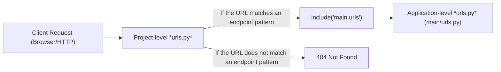

# Tutorial 1: Introduction to Django Application and Model-View-Template in Django


Platform-Based Programming (CSGE602022) — Organized by the Faculty of Computer Science Universitas Indonesia, Odd Semester 2025/2026

_Last updated: September 2 2025, 08:00 PM (WIB)_


---
### Learning Objectives
After completing this tutorial, students are expected to be able to:

- Understand the concept of **MVT** on a Django application
- Understand the **flow Django uses to display a HTML page**
- Understand routing configurations on `urls.py`
- Understand the relationship between models, views and templates in Django
- Understand the process of creating unit tests on the Django framework

## Introduction to the concept of MVT (Model-View-Template)

In the world of web development, there are several architectural patterns that help developers in designing and developing applications. Examples include MVC (Model-View-Controller), MVT (Model-View-Template), and many more. In this course, we will focus on Django's architectural pattern, MVT.


### What is MVT?

As you might have guessed, MVT comprises three components: the Model, the View, and the Template. In short:
- The Model component handles data and business logic
- The Template component contains the interface displayed to the user
- The View component acts as a bridge between the data (Model) and the interface (Template)

### What is a Model?

The Model is responsible for **managing** data on the application. Django has Object Relational Mapping (ORM) built-in, allowing us to use Python syntax instead of raw SQL, which is what traditional databases typically use.

Here is an example of a Model:
```python
class News(models.Model):
    title = models.CharField(max_length=255)
    content = models.TextField()
    date_added = models.DateField(auto_now_add=True)
```

### What is a View?

The View component contains the logic handling what will be shown to the user. First, the View component receives a request from the user. Next, it retrieves data from the Model. Finally, it sends this data to the Template to be displayed to the user.

Here is an example of a View:
```python
def show_main(request):
    news_list = News.objects.all()
    return render(request, "main.html", {"news_list": news_list})
```

### What is a Template?

Template consists of HTML files that determine how the application is displayed.

Here is an example of a Template:
```html
<h1>News List</h1>
<ul>
  
    <li>{{ news.title }} - {{ news.date_added }}</li>
  
</ul>
```

### MVT Flow

1. The user accesses the desired URL with their browser.
2. Django will map the requested URL to a View via `urls.py`.
3. The View retrieves and processes data from the Model (if necessary).
4. The View then sends the result to the Template to be displayed to the user.

:::info
Here's the short version:
Request → urls → View → Model → View → Template → Response
:::

### Benefits of MVT

There are many benefits of the MVT architecture, such as:
1. Separation of Concerns
MVT provides clear separation between application logic, interface, and data, allowing developers to manage each component easily.
2. Structured Code
With MVT, applications are more modular, easier to test, and scalable.
3. Reusability
Templates and Views can be reused in other parts of the application.

## Pre-Tutorial Notes

Before starting this tutorial, make sure you have completed Tutorial 0 with the following results:

1. Local directory structure for football-news:

    

2. GitHub repository directory structure for football-news:

    

If you accidentally pushed sensitive files like `.env`, `.env.prod`, `db.sqlite3`, or the `env/` folder, remove them from Git using:

```bash
git rm --cached .env .env.prod db.sqlite3
git rm -r --cached env/
```

**Note**: The above commands remove sensitive files from Git tracking going forward.

Check if `.gitignore` already contains these sensitive files:
```bash
cat .gitignore
```

If not present, add to `.gitignore`:
```
.env*
db.sqlite3
env/
```

Then create a clean up commit:

```bash
git add .
git commit -m "cleanup"
```

Finally, push all changes to GitHub and PWS:
```bash
git push origin master
git push pws master
```

This way, we can minimize security risks from credentials exposed in public repositories.

## Tutorial: Creating a Django Application and Configuring the Model

In this tutorial, the concepts of applications and projects in Django will be explained.

**What are Projects and Applications in Django?**

- A **Project** is an entire web project in Django. **Projects contain multiple applications** that work together to create a complete website or web application.

- An **Application** is a modular unit that does a specific task in a Django project. Each application can have its own models, views, templates, and URLs. Applications allow you to break down functionalities into separate and manageable components that can be handled independently.

Before starting, remember that the root directory is the **outer** directory (`football-news`), while the project directory is the directory **inside** the root directory (`football_news`).

### Step 1: Preparation

1. Open the **`football-news`** root directory.

    - Before starting, make sure you are on the `football-news` **root** directory that you made in Tutorial 0.
    - The development of your Django project will be done in this directory 😎. 

2. Open your terminal or command prompt and make sure that you are on the `football-news` root directory.

:::info

- Use the `cd [directory]` command to switch between folders/directories. This command is very important to remember since being able to use the terminal proficiently will be very helpful, not only in this course but in future courses as well.
:::

3. Activate the virtual environment created in the last tutorial by running the following command. **(Please take note of the operating system that you are using)**.

   - **Windows:**

     ```bash
     env\Scripts\activate
     ```

   - **Unix (Linux & Mac OS):**

     ```bash
     source env/bin/activate
     ```
:::info
- For Windows users, if you receive an error saying "The execution of scripts is disabled on this system...", try the following:
    - Open PowerShell as an **administrator** and run the following command:
        ```pwsh
        Set-ExecutionPolicy Unrestricted -Force
        ```
    - Pick option `A` and press `Enter`.
- For Unix (Linux & macOS) users, if you receive an error saying "... Permission Denied", try the following:
    - Run this command:
        ```bash
        chmod +x env/bin/activate
        ```
:::

### Step 2: Creating the `main` Application Inside the *football-news* Project

You will create a new application called `main` inside the `football-news` project.

1. Run the following command to create a new application with the name **main**.

     ```shell
     python manage.py startapp main
     ```

    After running the command above, a new directory with the name `main` will be created. The `main` directory will contain the starting structure for your Django application.

:::warning
If you are still confused about terms such as **root directory**, **project directory**, and **application directory**, that's okay! You will get used to it as time goes by. Keep going!
:::

2. Register the `main` application on the project.

   - Open the `settings.py` file inside the `football_news` project directory.
   - Add `'main'` to the bottom of the list of applications. You can find this in the `INSTALLED_APPS` variable as shown below.

     ```python
     INSTALLED_APPS = [
         ...,
         'main'
     ]
     ```

By following these steps, you have successfully registered the `main` application to your football news project.

## Tutorial: Implementing Basic Templates

Here, you will create a template in the `templates` directory within `main`. This template is used to display data from your football news program.

:::warning

Right now, the football news application won't display any data. This will be implemented in Tutorial 2. Look forward to it!
:::

### Step 1: Creating and Filling the `main.html` File

Let's get acquainted with HTML first. HTML (Hypertext Markup Language) is a markup language used on web pages to interpret and write text, images, and other media visually and audibly.

:::warning
Hint: You will learn more about HTML in Tutorial 4.
:::

1. **Create a new directory** named `templates` inside the `main` application directory.

2. Inside the `templates` directory, **create a new file** named `main.html` and fill the `main.html` file with the following code. **Change the name and class according to your personal information!**


     ```html
     <h1>Football News</h1>

     <h4>NPM: </h4>
     <p>2406123456</p> <!-- Use your NPM here -->
     <h4>Name: </h4>
     <p>Pak Bepe</p> <!-- Use your name here -->
     <h4>Class: </h4>
     <p>PBP A</p> <!-- Use your class here -->
     ```

3. Open the HTML file in a web browser.

   - Before connecting it to the application, try opening the `main.html` file in your web browser.
   - Note that at this stage we are **only checking** the basic HTML display; the web page itself **is not connected to Django yet.**
   - Here's an example of what you should see.
     

## Tutorial: Implementing Basic Models

### Step 1: Modifying the `models.py` File in the `main` Application

Here, you will modify the `models.py` file located in the `main` application directory to define a new model.

1. Open the `models.py` file in the `main` application directory.

2. Fill the `models.py` file with the following code.


    ```python
    import uuid
    from django.db import models

    class News(models.Model):
        CATEGORY_CHOICES = [
            ('transfer', 'Transfer'),
            ('update', 'Update'),
            ('exclusive', 'Exclusive'),
            ('match', 'Match'),
            ('rumor', 'Rumor'),
            ('analysis', 'Analysis'),
        ]
    
        id = models.UUIDField(primary_key=True, default=uuid.uuid4, editable=False)
        title = models.CharField(max_length=255)
        content = models.TextField()
        category = models.CharField(max_length=20, choices=CATEGORY_CHOICES, default='update')
        thumbnail = models.URLField(blank=True, null=True)
        news_views = models.PositiveIntegerField(default=0)
        created_at = models.DateTimeField(auto_now_add=True)
        is_featured = models.BooleanField(default=False)

        def __str__(self):
            return self.title

        @property
        def is_news_hot(self):
            return self.news_views > 20

        def increment_views(self):
            self.news_views += 1
            self.save()
        
    ```

    **Code Explanation:**

    - `models.Model` is the base class used to define models in Django.
    - `News` is the name of the model we're defining.
    - `CATEGORY_CHOICES` is a tuple that defines available news category options.
    - `id` is a field of type `UUIDField` used as primary key with automatically generated values using `uuid.uuid4`.
    - `title` is a field of type `CharField` for news title, with maximum length of 255 characters.
    - `content` is a field of type `TextField` for news content that can hold long text.
    - `category` is a field of type `CharField` with limited choices according to `CATEGORY_CHOICES`, with default value 'update'.
    - `thumbnail` is a field of type `URLField` for storing news thumbnail image URL (optional).
    - `news_views` is a field of type `PositiveIntegerField` that stores the number of news views, with default value 0.
    - `created_at` is a field of type `DateTimeField` that automatically contains the date and time when data is created.
    - `is_featured` is a field of type `BooleanField` to mark whether this news is displayed as featured news.
    - The `__str__` method is used to return a string representation of the object (in this case, the news title).
    - The `@property` decorator is used to create read-only attributes whose values are calculated from other attributes. In this case, `is_news_hot` will be `True` if the news views are more than 20.
    - The `increment_views()` method is used to increase the news views by 1 and save the changes to the database.

    :::info
     You will learn more about "derived attributes" in the Database course. In the meantime, if you would like to know more about the `@property` decorator, you can read [Python's documentation on the *property* class](https://docs.python.org/3/library/functions.html#property).
    :::


### Step 2: Creating and Applying Model Migrations

**What are model migrations?**

- Model migrations are Django's way of tracking changes to your database models.
- These migrations are instructions to change the database table structure according to the changes in the model defined in your latest code.

**How do we perform model migrations?**

1. Run the following command to create model migrations.

    ```shell
    python manage.py makemigrations
    ```

    :::info
    `makemigrations` creates migration files containing model changes that have **not yet** been applied to the database.
    :::

2. Run the following command to apply migrations to the local database.

    ```shell
    python manage.py migrate
    ```

    :::info
    `migrate` applies the model changes listed in the migration files to the database.
    :::

:::warning
**Every time you make changes to the model**, such as adding or changing attributes, **you MUST perform migrations** to apply these changes.
:::

## Tutorial: Connecting the View and Template

Here, you will connect the View component with the Template component using Django.

### Step 1: Integrating MVT Components

We will import the necessary modules and create the `show_main` view function.

1. Open the `views.py` file located in the `main` application file.

2. If not already present, add the following import lines at the very top of the file.

    ```python
    from django.shortcuts import render
    ```

    **Code Explanation:**

    - `from django.shortcuts import render` is used to import the *render* function from the `django.shortcuts` module.
    - The *render* function will be used to *render* HTML files along with the data given to it.

3. Add the `show_main` function below the imports:

    ```python
    def show_main(request):
        context = {
            'npm' : '240123456',
            'name': 'Haru Urara',
            'class': 'PBP A'
        }

        return render(request, "main.html", context)
    ```

    **Code Explanation:**

    - The code snippet above declares the `show_main` function, which accepts a `request` parameter. This function will handle HTTP requests and return the appropriate view.
    - `context` is a *dictionary* containing data to be sent to the view. Currently, there are three pieces of data included, namely:

       - `npm`: Your NPM.
       - `name`: Your name.
       - `class`: Your class.

    - `return render(request, "main.html", context)` is used to render the `main.html` view using the `render` function. The `render` function takes three arguments:

       - `request`: This is an HTTP request object sent by the user.
       - `main.html`: This is the name of the *template* file that will be used to render the view.
       - `context`: This is the *dictionary* containing data that will be passed to the view for dynamic rendering.

### Step 2: Template Modification

Here, you will modify the `main.html` template to display data that has been retrieved from the model.

1. Open the `main.html` file that was previously created in the `templates` directory in the `main` directory.

2. Change the name and class to the necessary Django code to display the data.

    ```html
    ...
    <h5>NPM: </h5>
    <p>{{ npm }}</p>
    <h5>Name: </h5>
    <p>{{ name }}</p>
    <h5>Class: </h5>
    <p>{{ class }}</p>
    ...
    ```

    **Code Explanation:**

    The Django syntax `{{ npm }}`, `{{ name }}`, and `{{ class }}`, usually called template variables, is used to display the values of variables that have been defined in the `context` variable.

## Tutorial: Configuring URL *Routing*

After creating a template and configuring it in our view, we will now learn about routing so that our `main` application can be accessed by a browser client.

**What is Routing in Django?**

Routing is the process of mapping a URL (endpoint) to a view function or class-based view that we've defined. When a client accesses a URL, Django will attempt to match this URL with patterns defined in the `urls.py` file. If it finds a match, Django will execute the corresponding view and return a response to the client.

:::info
Note: A [class-based view](https://docs.djangoproject.com/en/5.2/topics/class-based-views/intro/) is an alternative method you can use to create views; instead of using functions, it uses classes to help better organize your code.
:::

Let's try implementing some simple routing by mapping http://localhost:8000/ to the `show_main` function you have made!

### Step 1: Configuring the URL *Routing* for the `main` application

1. Create a `urls.py` file **in** the `main` directory.
2. Paste the following code inside `urls.py`:

```python
from django.urls import path
from main.views import show_main

app_name = 'main'

urlpatterns = [
    path('', show_main, name='show_main'),
]
```

**Code Explanation:**

- The `urls.py` file contains routing configurations for the `main` application.
- We import the `path` function from the `django.urls` module to define URL patterns.
- We import the `show_main` function from `main.views` to be called when a URL matches the defined pattern.
- `app_name = 'main'` is used to give a unique namespace to URLs in an application, making them easily distinguishable when there are many applications and endpoints in our Django project.
- `urlpatterns` is a list containing `URLPattern` objects returned by the `path()` function.
- In this example, there is only one route `''` (root), which will call the `show_main` view.
- The optional argument `name='show_main'` allows us to easily reverse URLs using a path's name, not its hardcoded string. 
- You can learn more about reversing URLs [here](https://docs.djangoproject.com/en/5.2/ref/urlresolvers/).

### Step 2: Configuring the Project's URL *Routing*

Next, we will complete the routing by configuring the `urls.py` file at the project level so that our project can map requests to routes in the `main` application.

1. Open the `urls.py` file **inside** the `football_news` project directory, not the one inside the `main` directory.
2. Import the `include` function from `django.urls`.
```python
...
from django.urls import path, include
...
```
3. Add the following URL route in the `urlpatterns` variable to direct requests to the `main` view.
```python
urlpatterns = [
    ...
    path('', include('main.urls')),
    ...
]
```
**Code Explanation**
- The `urls.py` file at the project level is responsible for managing URL routes for the whole project.
- The `include` function is used to import URL route patterns from other applications (in this case, the `main` application) into the project-level `urls.py` file.
- The URL path `''` will be forwarded to the routes defined in `urls.py` inside the `main` application. The path URL is deliberately set to the empty string so the main page can be accessed directly.

:::info
As an example, if the URL path was instead configured as `path('main_application/', ...)` on the example above, then you would need to access http://localhost:8000/main_application/ to view the main page. Setting the URL path to `''` allows you to access the main page directly with http://localhost:8000/.
:::

4. Run the Django project with the command `python manage.py runserver`.
5. Open http://localhost:8000/ in your web browser to view the page you have created.

### How Does Routing Work?

To get a better idea on how routing works, take a look at the following diagram illustrating the difference between `urls.py` at the project level and `urls.py` at the application level.



**Diagram Explanation**
- **Client Request** → A request made by a browser/HTTP client.  
- **Project-level `urls.py`** → All requests first make their way to `urls.py` at the project level.  
   - If the requested URL matches the pattern associated with `include('main.urls')`, the request will be forwarded to the application-level `urls.py`.  
   - If it doesn't match, Django returns `404 Not Found`.  
- **Application-level `urls.py`** → The request will be processed according to the patterns defined in the application (`main/urls.py`).  
- **View** → If a match is found, the corresponding function/class-based view will be executed.  

### What is the Difference Between `urls.py` in a Project and `urls.py` in Applications?

- The `urls.py` file in applications sets up specific URL routes for the features within that app.
- The `urls.py` file in a project directs URL routes for the whole project and can import URL routes from the `urls.py` files of applications, allowing the apps in a Django project to be modular and separate.

With the above steps, you have successfully implemented a basic view in the `main` app and connected it with the project's URL route. Make sure you understand each step and the information provided to enable the view in your Django project.


## Tutorial: Introduction to Django Unit Testing

*Unit testing* can be used to check if the code you have written works as intended. It is also helpful when you make changes to the code. By using tests, you can verify whether the changes made cause any unwanted behavior in the application.

### Step 1: Creating Unit Tests
1. Create the `tests.py` file in the `main` app directory.
2. Write the following code in `tests.py`:

```python
from django.test import TestCase, Client
from .models import News

class MainTest(TestCase):
    def test_main_url_is_exist(self):
        response = Client().get('')
        self.assertEqual(response.status_code, 200)

    def test_main_using_main_template(self):
        response = Client().get('')
        self.assertTemplateUsed(response, 'main.html')

    def test_nonexistent_page(self):
        response = Client().get('/burhan_always_exists/')
        self.assertEqual(response.status_code, 404)

    def test_news_creation(self):
        news = News.objects.create(
          title="BURHAN FC WINS",
          content="BURHAN FC 1-0 PANDA BC",
          category="match",
          news_views=1001,
          is_featured=True
        )
        self.assertTrue(news.is_news_hot)
        self.assertEqual(news.category, "match")
        self.assertTrue(news.is_featured)
        
    def test_news_default_values(self):
        news = News.objects.create(
          title="Test News",
          content="Test content"
        )
        self.assertEqual(news.category, "update")
        self.assertEqual(news.news_views, 0)
        self.assertFalse(news.is_featured)
        self.assertFalse(news.is_news_hot)
        
    def test_increment_views(self):
        news = News.objects.create(
          title="Test News",
          content="Test content"
        )
        initial_views = news.news_views
        news.increment_views()
        self.assertEqual(news.news_views, initial_views + 1)
        
    def test_is_news_hot_threshold(self):
        # Test news with exactly 20 views (should not be hot)
        news_20 = News.objects.create(
          title="News with 20 views",
          content="Test content",
          news_views=20
        )
        self.assertFalse(news_20.is_news_hot)
        
        # Test news with 21 views (should be hot)
        news_21 = News.objects.create(
          title="News with 21 views", 
          content="Test content",
          news_views=21
        )
        self.assertTrue(news_21.is_news_hot)
```

**Code Explanation**
- The `Client` class imported from `django.test` is used to simulate a client for unit testing purposes.
- The `test_main_url_is_exist` function checks whether the server gives a 200 (OK) response when the client accesses the endpoint (main page).
- The `test_main_using_main_template` function checks whether the main page returns status code 200 and is rendered using the `main.html` template.
- The `test_nonexistent_page` function tests that if the client accesses a URL that doesn't exist (e.g., /burhan_always_exists/), the Django application will return a 404 (Not Found) status code.
- The `test_news_creation` function tests creating a new News object with specific attributes (title, content, category, news_views, and is_featured). After the object is created, it checks the is_news_hot property, category, and is_featured.
- The `test_news_default_values` function tests the default values of the News model when only required fields (title and content) are filled, ensuring default category is "update", news_views is 0, is_featured is False, and is_news_hot is False.
- The `test_increment_views` function tests the functionality of the increment_views() method that increases views by 1.
- The `test_is_news_hot_threshold` function tests the threshold of the is_news_hot property, ensuring news with 20 views is not considered hot, while news with 21 views is considered hot.

### Step 2: Running the Unit Tests

There are 2 ways to run tests:

1. Run all the tests in every application's `test.py` file.
`python manage.py test` (Make sure to run the command at the project root directory as `manage.py` is a project-level file).

2. Run the tests for a specific application only.
`python manage.py test <application_name>` 

If the tests run successfully, you will see the following information:
```
Found 7 test(s).
Creating test database for alias 'default'...
System check identified no issues (0 silenced).
..
----------------------------------------------------------------------
Ran 7 tests in 0.016s

OK
Destroying test database for alias 'default'...
```

## Push to Repository

After completing this tutorial, save all changes to GitHub and PWS:

```bash
git add .
git commit -m "Complete tutorial 1: Django MVT implementation"
git push origin master
git push pws master
```

## Tutorial Final Results

Make sure your project structure matches the following images:

- Local directory structure
    
    

- GitHub repository structure
    
    

- Deployed website on PWS
    
    

## Final Words

Congratulations! You have completed this tutorial on the basics of Django, MVT, and unit testing!

Word of advice, make sure you understand every line of code you type. **Don't just copy-paste without understanding it first**. If you run into any problems, don't hesitate to ask the teaching assistants or your friends. Keep up the spirit in taking PBP classes for the rest of the semester, and don't forget to enjoy every process. Good luck!


## Additional References

- [Django Unit Testing](https://docs.djangoproject.com/en/5.2/topics/testing/overview/)
- [Django Model Unit Testing](https://stackoverflow.com/questions/64574713/django-models-unit-tests-help-for-a-newbie)
- [Django MVT Structure](https://www.geeksforgeeks.org/python/django-project-mvt-structure/)

## Contributors

- Valentino Kim Fernando (SOY) 
- Clarence Grady (GRD)
- Malvin Scafi (UMA)
- Danniel (DAN)
- Joshua Montolalu (UMI) (English Translator) 

## Credits

This tutorial was developed based on [PBP Odd 2025](https://github.com/pbp-fasilkom-ui/ganjil-2025) and [PBP Even 2024](https://github.com/pbp-fasilkom-ui/genap-2024) written by the 2025 Platform-Based Programming Teaching Team. All tutorials and instructions included in this repository are designed so that students who are taking the Platform-Based Programming course can complete the tutorials during lab sessions.